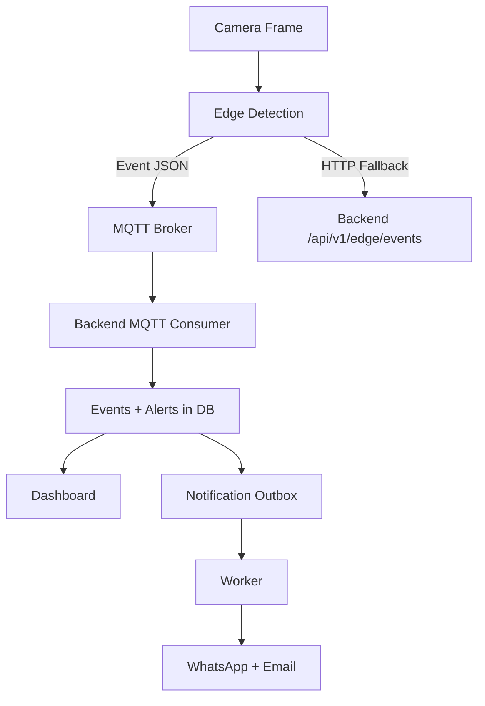

# 02 - Architecture

## High-level architecture (Mermaid)

```mermaid
flowchart LR
  subgraph Edge[Edge Node @ Godown]
    RTSP[RTSP Cameras]
    CV[CV Pipelines
(GATE_ANPR / SECURITY)]
    MQTT[MQTT Publisher]
    HTTP[HTTP Fallback
(edge events)]
  end

  subgraph Backend[Backend (FastAPI + Postgres)]
    Ingest[MQTT Consumer + HTTP Ingest]
    Rules[Rules & Alert Engine]
    DB[(PostgreSQL)]
    Outbox[Notification Outbox]
    Worker[Notification Worker + HQ Reports]
  end

  subgraph Dashboard[Dashboard (Next.js)]
    UI[Web UI]
  end

  RTSP --> CV
  CV --> MQTT
  CV --> HTTP
  MQTT --> Ingest
  HTTP --> Ingest
  Ingest --> DB
  Ingest --> Rules
  Rules --> DB
  Rules --> Outbox
  Outbox --> Worker
  Worker --> DB
  DB --> UI
```

## Why edge-first fits 10 Mbps

- **Edge detection** minimizes bandwidth by sending events, not video.
- **Evidence snapshots** are small and transmitted only when required.
- **MQTT QoS=1** ensures reliable event delivery without heavy overhead.

## Data flow summary (Mermaid)



## Key components

- **Edge node (per godown)**
  - RTSP ingest + CV pipelines
  - Role-based routing: GATE_ANPR vs SECURITY
  - Local snapshots + MQTT publishing

- **Backend (state-level)**
  - MQTT consumer and HTTP ingest
  - Rule engine for alerts
  - Postgres storage + evidence links
  - Outbox for reliable notifications

- **Dashboard (HQ + Godown)**
  - Alerts, watchlist, fire, after-hours, animal intrusion, ANPR sessions
  - Camera role visibility
  - Reports and delivery status

## Scaling to ~7000 cameras

- **Horizontal scale at edge:** multiple edge nodes per district, one per godown.
- **Backend:** scale MQTT consumers and API pods; Postgres tuned for write-heavy events.
- **Partitioning:** by godown/district for alerts and reports.
- **Storage:** object storage for evidence (future integration).

## Reliability controls

- **Idempotency:** event_id used to dedupe in backend.
- **Outbox pattern:** notifications retried with backoff.
- **Cooldowns:** per-event cooldown on edge and backend.
