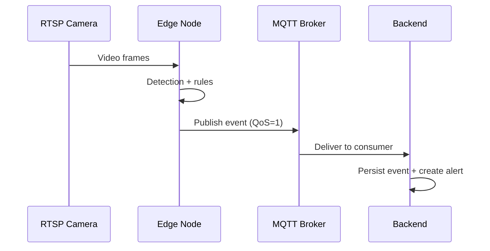

# 04 - Edge Node

## What the edge node does

- Ingests **RTSP** or test videos.
- Runs CV pipelines based on **camera roles**.
- Publishes **events** and **health heartbeats** via MQTT.
- Optional HTTP fallback for watchlist and after-hours events.

## Run the edge node

```bash
cd pds-netra-edge
python -m app.main --config config/pds_netra_config.yaml --device cpu
```

## RTSP requirements

- Stable RTSP stream per camera.
- Use H.264/H.265 where possible.
- Use wired connectivity for gate cameras.

## Model weights

Configured in `pds-netra-edge/config/pds_netra_config.yaml`:

- **General detector (YOLO)**: configured via `EDGE_YOLO_MODEL` or default `animal.pt`.
- **ANPR model**: `anpr.model_path` (default `./ML_Model/anpr.pt`).
- **Fire model**: `fire_detection.model_path` (default `models/fire.pt`).

If **fire model is missing**, the fire pipeline disables itself gracefully.

## Event publishing

### MQTT topics

- Events: `pds/{godown_id}/events`
- Health: `pds/{godown_id}/health`
- Watchlist (face match): `pds/{godown_id}/face-match`
- After-hours presence: `pds/{godown_id}/presence`

### HTTP fallback (where enabled)

- Endpoint: `POST /api/v1/edge/events`
- Used for **watchlist** and **after-hours** events when `http_fallback=true`.

### Sequence (Mermaid)



## Evidence capture

- Snapshots are saved locally and published as `image_url`.
- Default snapshot path (backend viewable):
  - `pds-netra-backend/data/snapshots`
- Base URL (if configured): `EDGE_SNAPSHOT_BASE_URL`

## Performance tuning (edge)

Use `.env.example` in `pds-netra-edge/` for tuning:

- `EDGE_DETECT_CLASSES`
- `EDGE_ALERT_MIN_CONF`
- `EDGE_AFTER_HOURS_PERSON_INTERVAL_SEC`
- `EDGE_FIRE_INTERVAL_SEC`
- `EDGE_ANIMAL_SPECIES_COOLDOWN_SEC`

## Troubleshooting checklist

- **No events arriving:** check MQTT broker `1883`, and `MQTT_BROKER_HOST`.
- **Camera offline alerts too frequent:** adjust `health` settings in camera config.
- **Fire detection not working:** confirm fire model path exists and `EDGE_FIRE_ENABLED=true`.
- **ANPR direction unknown:** verify `gate_line` and `inside_side`.
- **Face/Watchlist not working:** check `EDGE_WATCHLIST_ENABLED` and watchlist sync.
