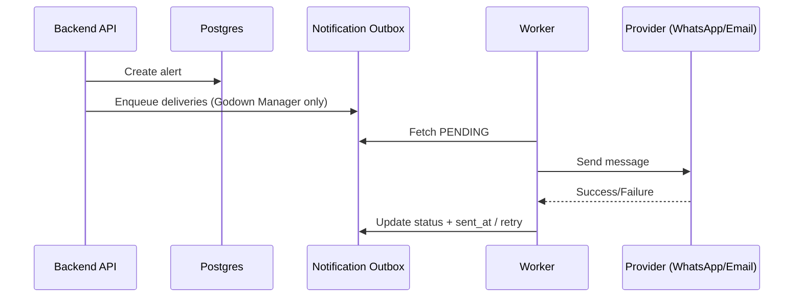

# 09 - Notifications Routing

## Routing policy (implemented)

- **Godown Manager** receives **real-time alerts** via WhatsApp + Email.
- **HQ** receives **digest reports only** (no individual alert pings).

This routing is enforced in `app/services/notification_outbox.py`.

## Outbox pattern

- Alert creation **never blocks** on provider delivery.
- Each delivery is written to `notification_outbox` with status:
  - `PENDING` -> `SENT` / `FAILED` / `RETRYING`
- Unique constraints prevent duplicates.

## Retry / backoff

- Backoff schedule (minutes): **1, 5, 15, 60, 360**
- Max attempts: `NOTIFY_MAX_ATTEMPTS` (default 6)

## Providers

### WhatsApp

- `WHATSAPP_PROVIDER=log|http`
- `WHATSAPP_HTTP_URL`
- `WHATSAPP_HTTP_TOKEN`

### Email

- `SMTP_HOST`, `SMTP_PORT`, `SMTP_USER`, `SMTP_PASS`, `SMTP_FROM`, `SMTP_USE_TLS`

If not configured, log providers are used (safe for PoC).

## Scheduling (HQ digest)

- **Daily** report at `09:00 IST` (configurable via `HQ_REPORT_DAILY_TIME`).
- **Optional hourly** digest (disabled by default).

## Sequence (Mermaid)

## Message templates (examples)

- **After-hours person:**
  - `After-hours Person Detected | Pethapur | Cam-Entry | 22:14 IST | Evidence: <url>`
- **Dispatch delay:**
  - `Dispatch delay: GJ01AB1234 inside since 6h | Pethapur | Evidence: <url>`

## Audit trail

- Delivery status per alert is accessible via:
  - `GET /api/v1/alerts/{alert_id}/deliveries`

## Not implemented yet

- **Weighbridge alerts** (no delivery routing exists yet).
